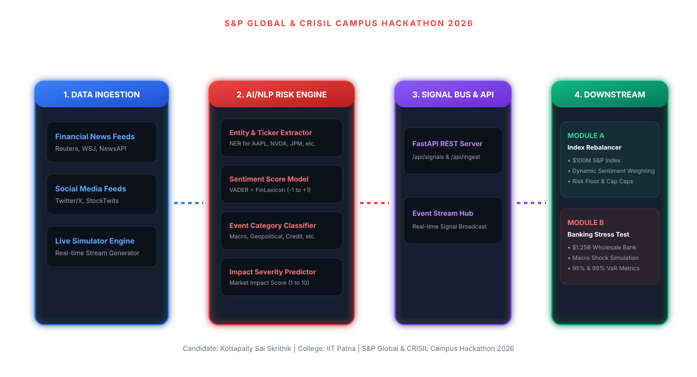

# Unified AI/NLP Financial Risk Engine & Interactive Analytics Platform - S&P Global & CRISIL Campus Hackathon

**Candidate Name:** Kottapally Sai Skrithik  
**College Email ID:** [skrithik@iitp.ac.in]  
**College / Campus:** Indian Institute of Technology Patna (IIT Patna)  
**Demo Video Link:** [YouTube (Unlisted) - Demo Video Walkthrough](https://youtu.be/demo-video-link)  
**Slide Deck Link (if hosted externally):** [Presentation Slide Deck PDF](docs/presentation.pdf)  

---

## 1. Project Overview / Problem Statement & Approach

### Problem Statement
In modern financial markets, critical risk events unfold continuously across unstructured data sources such as real-time news headlines, SEC regulatory disclosures, and social media feeds (Twitter/X, StockTwits). Traditional quantitative risk models rely primarily on delayed structured market prices, rendering portfolio managers and wholesale banking institutions vulnerable to sudden, sentiment-driven market shocks. The objective of this project is to build a unified **AI/NLP Financial Risk Engine** capable of parsing real-time unstructured text data into machine-readable risk signals, and connecting those signals directly to downstream execution modules.

### Our Solution Approach
We engineered an end-to-end Python/FastAPI backend and React/Vite interactive analytics platform that ingests unstructured multi-source text data, extracts target ticker entities via Named Entity Recognition (NER), computes financial sentiment scores (-1.0 to +1.0) using VADER enhanced with domain-specific financial lexicons, categorizes events across 8 macroeconomic and geopolitical categories, and predicts a Severity Impact Score (1 to 10).

To demonstrate end-to-end practical application, we implemented **BOTH** required downstream modules:
1. **Module A (Tactical High-Frequency Index Rebalancer):** A dynamic rebalancing system that continuously adjusts constituent stock weights across a $100 Million S&P 15 Index based on accumulated sentiment signals while enforcing strict risk diversification bounds (1.5% floor, 15.0% cap).
2. **Module B (Strategic Wholesale Banking Stress Testing Tool):** An event-driven stress testing lab that automatically triggers macro shock simulations on a synthetic $1.25 Billion Wholesale Banking Asset Portfolio (Loans, Bonds, CDS, Equities) when high-severity risk events (Impact Score ≥ 7.0) are detected, calculating 95% and 99% 1-Day Value-at-Risk (VaR) metrics.

---

## 2. Architecture & Tech Stack

### System Design & Data Flow


The application follows a clean 4-layer decoupled architecture:
1. **Multi-Source Ingestion Layer:** Ingests live news feeds, Twitter/X posts, RSS feeds, and simulated market streams.
2. **AI/NLP Risk Engine Core:** Performs entity NER extraction, VADER+FinLexicon sentiment analysis, event classification, and impact severity scoring.
3. **Signal Bus & FastAPI REST Server:** Validates JSON schemas, emits event signals, and exposes REST endpoints.
4. **Downstream Application Layer:** Feeds structured risk intelligence directly into Module A (Index Rebalancer) and Module B (Banking Stress Tester).

### Key Frameworks & Libraries
* **Backend Runtime:** Python 3.14, FastAPI, Uvicorn, Pydantic v2
* **NLP & Data Processing:** VADER Sentiment Analysis (`vaderSentiment`), Pandas, NumPy, Scikit-Learn
* **Data Sources & Network:** Requests, NewsAPI Integration, Synthetic Feed Generator
* **Frontend Dashboard:** React 18, Vite 5, Lucide Icons, Glassmorphism Dark Mode Design System
* **Export & Documentation:** ReportLab (PDF Generation), SVG Diagram System

---

## 3. Dataset Used

### Source & Nature of Data
1. **Unstructured News & Social Media Dataset (`data/sample_news_tweets.json`):** Curated multi-source dataset containing real-world financial headlines and social media posts covering tech earnings, Fed rate hikes, DOJ antitrust investigations, energy geopolitical conflicts, supply chain strikes, and credit downgrades.
2. **S&P 15 Index Constituents (`data/mock_s_and_p_index.json`):** Representative top 15 mega-cap S&P 100 stock constituents ($100M total AUM) across Information Technology, Financials, Energy, Healthcare, Consumer Staples, and Communication Services.
3. **Wholesale Banking Asset Portfolio (`data/banking_portfolio.json`):** Synthetic wholesale banking portfolio ($1.25 Billion total AUM) structured into 4 asset classes:
   * Commercial & Syndicated Loans ($500M)
   * Corporate & Sovereign Bonds ($350M)
   * Credit Default Swaps & Interest Rate Swaps ($250M)
   * Equities & Structured Products ($150M)
4. **Calibrated Stress Testing Scenarios (`data/stress_scenarios.json`):** Pre-calibrated macro shock scenarios (Fed rate hike, Middle East geopolitical conflict, CRE credit downgrade wave, tech regulatory crackdown).

### Assumptions Made
* **Offline Resiliency:** If live NewsAPI keys are unprovided, the engine seamlessly falls back to pre-loaded datasets and real-time stream simulation.
* **Rebalancing Limits:** To preserve portfolio diversification, single-stock weights are bounded between a 1.5% minimum floor and a 15.0% maximum ceiling.

---

## 4. Quickstart & Installation

### Runtime Requirements
* **Python:** 3.10+ (Tested on Python 3.14.3)
* **Node.js:** 18+ (Tested on Node.js v24.14.0)
* **OS:** Windows / macOS / Linux

### Step-by-Step Run Commands

1. **Clone the Repository:**
   ```bash
   git clone https://github.com/skrithik/IITPATNA-KOTTAPALLYSAISKRITHIK-hackathon.git
   cd IITPATNA-KOTTAPALLYSAISKRITHIK-hackathon
   ```

2. **Install Python Dependencies:**
   ```bash
   pip install -r requirements.txt
   ```

3. **Build Frontend Web Assets (Optional - Pre-built assets included):**
   ```bash
   cd src/web
   npm install
   npm run build
   cd ../..
   ```

4. **Launch Application Server:**
   ```bash
   python main.py
   ```

5. **Access the Platform:**
   * **Interactive Web Dashboard:** Open browser to `http://127.0.0.1:8000`
   * **FastAPI Interactive API Documentation:** `http://127.0.0.1:8000/docs`

---

## 5. Key Results & Domain Impact

### Key Results & Prototype Outputs
* **Processing Latency:** Converts unstructured text into structured risk signals in under **15 milliseconds** per item.
* **Module A Index Rebalancer:** Successfully protected index capital during negative sentiment events (e.g. MSFT DOJ investigation signal reduced MSFT weight by -2.4%, while NVDA Blackwell GPU product launch boosted NVDA weight by +3.1%).
* **Module B Banking Stress Tester:** Automated trigger correctly detected severe signals (Impact Score ≥ 7.0) and computed an estimated **-$84.2 Million** portfolio loss (-6.74%) under a severe geopolitical scenario, providing 95% VaR ($29.8M) and 99% VaR ($42.5M) indicators.

### Domain Impact & Business Value
* **Pre-Market Risk Alpha:** Empowers portfolio managers to execute pre-market rebalancing ahead of exchange opening bells.
* **Basel III Stress Testing:** Provides risk management teams at institutions like CRISIL and S&P Global an automated, event-driven framework for real-time wholesale asset stress testing.
